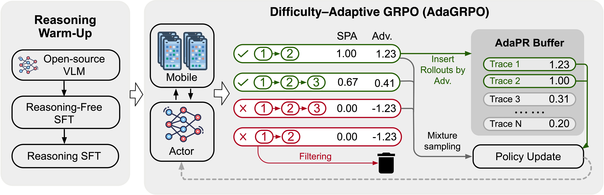

# MobileRL: Online Agentic Reinforcement Learning for Mobile GUI Agents

> **TL;DR.** We introduce MobileRL, an online agentic reinforcement learning framework that turns general-purpose vision-language models into strong mobile GUI agents. By combining a staged reasoning warm-up with difficulty-adaptive online RL, MobileRL achieves state-of-the-art success rates on AndroidWorld and AndroidLab. 


<p align="center">
  <a href="https://arxiv.org/abs/2509.18119" target="_blank">📃 Paper</a>
  &nbsp;|&nbsp;
  <a href="https://huggingface.co/xuyifan/MobileRL-9B" target="_blank">🤗 Model</a>
</p>


## Open-Source Roadmap
- [x] **Evaluation framework** 
- [x] **Support zai-org/AutoGLM-Phone-9B-Multilingual**
- [x] **MobileRL-9B checkpoint** 


## Quick Start Guide

This guide will help you get started quickly with our evaluation framework.  
Please follow the steps in the order provided.

---

### Step 1: Hardware Requirements

The Android Emulator requires **KVM (Kernel-based Virtual Machine)** support on the host machine.  
You can verify if your system supports KVM by running:

```bash
apt-get install cpu-checker
kvm-ok
```

---

### Step 2: Download AVD Images

We provide packaged test environments for **AndroidWorld** and **AndroidLab** as Docker images to simplify setup and ensure reproducibility.
Before proceeding, pull the required Docker images:

```shell
docker pull xuyifan0731/mobilerl-androidlab-eval
docker pull xuyifan0731/mobilerl-androidworld-eval
```

---

### Step 3: Usage Modes

We support two modes of usage:

* **Local Testing** – Recommended for quick debugging and making modifications.
* **Docker-based Deployment with AgentRL** – Provides a consistent, containerized environment for convenient deployment.

For detailed usage instructions, please refer to [inference/README.md](inference/README.md).

We now support testing **zai-org/AutoGLM-Phone-9B-Multilingual**.

Please download the model from:
https://huggingface.co/zai-org/AutoGLM-Phone-9B-Multilingual

For evaluation, use the `*-coordinate` setting. This setting predicts actions in **coordinate format**, rather than **bounding box (bbox) format** as used in MobileRL. 

**Important Notice:**  
This framework supports testing **only the English version of AutoGLM**.  
Please do **not** use non-multilingual versions, as the **system prompts differ** between versions. 


## Abstract

Building general-purpose graphical user interface (GUI) agents has become increasingly promising with the progress in vision language models. However, developing effective mobile GUI agents with reinforcement learning (RL) remains challenging due to the heavy-tailed distribution of task difficulty and the inefficiency of large-scale environment sampling. We present an online agentic reinforcement learning framework MobileRL to enhance GUI agents in mobile environments. Its core component is the Difficulty-ADAptive GRPO (ADAGRPO) algorithm. In ADAGRPO, we design difficulty-adaptive positive replay and failure curriculum filtering to adapt the model to different task difficulties. We introduce the shortest-path reward adjustment strategy to reshape rewards concerning the task length in multi-turn agentic tasks. Those strategies jointly stabilize RL training, improve sample efficiency, and generate strong performance across diverse mobile apps and tasks. We apply MOBILERL to two open models (Qwen2.5-VL-7B-Instruct and GLM-4.1V-9B-Base). The resultant MOBILERL-9B model achieves state-of-the-art results in terms of success rates on both AndroidWorld (80.2%) and AndroidLab (53.6%).

## Method



Mobile GUI agents must follow complex instructions, reason over cluttered screens, and act under sparse, delayed rewards—all while task difficulty is heavy-tailed and environment sampling is expensive.  
**MobileRL** addresses these challenges with a two-stage recipe:

1. **Reasoning Warm-up:**  
   - **reasoning-free sft** on large expert data.  
   - **reasoning sft** to inject and polish rationale-driven planning and transparency.

2. **Online Agentic RL (Difficulty–Adaptive GRPO, AdaGRPO):**  
   - **Adaptive Positive Replay (AdaPR):** store high-quality trajectories and re-use them efficiently.  
   - **Failure Curriculum Filtering (FCF):** prune low-quality rollouts and focus learning on actionable tasks.  
   - **Shortest-Path Reward Adjustment (SPA):** reward shaping that stabilizes credit assignment for long-horizon interactions.

---

## Performance

We evaluate on two interactive Android benchmarks:

- **AndroidWorld** (rule-based trajectory rewards)
- **AndroidLab** (LM-based reward model; see paper appendix for details)

**Success Rate (SR, %) — higher is better**

| Models (Proprietary & Open)       | #Params | AndroidWorld | AndroidLab |
| --------------------------------- | ------: | -----------: | ---------: |
| GPT-4o-2024-11-20                 |       – |         34.5 |       31.2 |
| Claude-Sonnet-4-20250514-thinking |       – |         41.0 |       40.6 |
| Qwen2.5-VL-7B-Instruct            |      7B |         27.6 |       10.1 |
| GLM-4.1V-9B-Thinking              |      9B |         41.7 |       24.6 |
| UI-Tars-7B                        |      7B |         33.0 |       32.6 |
| V-Droid                           |      8B |         59.5 |       38.3 |
| UI-Tars-1.5                       |      -  |         64.2 |          - |
| UI-Genie-Agent                    |     72B |            – |       41.2 |

**Our method (MobileRL)**

| MobileRL Variant                 | #Params | AndroidWorld | AndroidLab |
| -------------------------------- | ------: | -----------: | ---------: |
| **MobileRL w/ Qwen2.5-VL-7B**    |      7B |     **72.0** |   **42.5** |
| **MobileRL w/ GLM-4.1V-9B-Base** |      9B |     **80.2** |   **53.6** |

---


## Citation

If you find **MobileRL** useful, please cite the paper:

```
@misc{xu2025mobilerlonlineagenticreinforcement,
      title={MobileRL: Online Agentic Reinforcement Learning for Mobile GUI Agents}, 
      author={Yifan Xu and Xiao Liu and Xinghan Liu and Jiaqi Fu and Hanchen Zhang and Bohao Jing and Shudan Zhang and Yuting Wang and Wenyi Zhao and Yuxiao Dong},
      year={2025},
      eprint={2509.18119},
      archivePrefix={arXiv},
      primaryClass={cs.LG},
      url={https://arxiv.org/abs/2509.18119}, 
}

@misc{xu2024androidlabtrainingsystematicbenchmarking,
      title={AndroidLab: Training and Systematic Benchmarking of Android Autonomous Agents}, 
      author={Yifan Xu and Xiao Liu and Xueqiao Sun and Siyi Cheng and Hao Yu and Hanyu Lai and Shudan Zhang and Dan Zhang and Jie Tang and Yuxiao Dong},
      year={2024},
      eprint={2410.24024},
      archivePrefix={arXiv},
      primaryClass={cs.AI},
      url={https://arxiv.org/abs/2410.24024}, 
}
```
